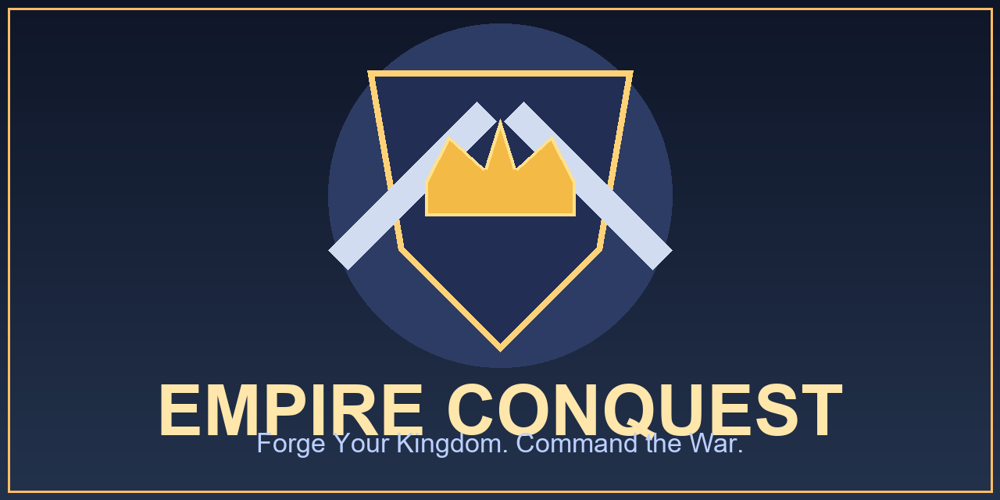

# Empire Conquest

Empire Conquest is a real-time strategy project inspired by modern kingdom-builders (base building, economy, troop training, hero power, and combat simulation).

## Project Direction

- Port gameplay logic from JS prototype to Unity C#.
- Build modular gameplay services for easy balancing and scaling.
- Ship playable Android and Windows builds from the Unity project.

## Current Unity Progress

- Unity project created in `Unity/EmpireConquestUnity`.
- Expanded economy chain:
  - Town Hall power, Residence, Gold/Gem/Rock/Coal/Iron/Wood mining
  - Plank Maker, Brick Factory, Crafting Hall
- Military systems:
  - Army Camp + Dark Army Camp + Barrack
  - units: swordsman, archer, cavalry, catapult, siege ram, mercenary scout, armored soldier, witch, golem, skeleton
  - battle simulation with mixed-unit arena behavior
- Hero systems:
  - hero recruitment, hero leveling, hero abilities
  - pets (dragon/bear) with stat bonuses
  - intro one-liners in hero/pet definitions
- Defense systems:
  - walls, archer tower, cannon, mortar, eagle artillery, air rocket defense
- Support systems:
  - hospital healing for injured troops
  - spell factory and laboratory hooks
  - builder purchase/upgrade with gems
- Meta systems:
  - events, challenges, achievements, badges
  - profile customization, leaderboard, base visit flow
  - guild shop + guild tokens/clan tokens
  - chest + random gift rewards
  - clan castle donations (troops/tokens)
  - active speed boosts (building/training/healing)
  - troll raid defense + revenge attacks on enemy camps
  - clan war starter loop + points tracking
  - laboratory research progression (mining/troop research levels)
  - Town Hall level gates and building unlock requirements
  - storage capacity system (Town Hall, Treasury, Clan Hall)
  - timed building upgrades + cancel with 80% refund
  - wall upgrades set to instant
  - base land expansion with level cap and TH requirement
- World feel:
  - roaming NPC + pet companion in base scene
  - music director hooks for calm vs battle mode
- Phase-2 scene flow:
  - dedicated `EmpireMain`, `TrollMap`, and `ClanWar` scenes
  - non-IMGUI runtime UI panel bootstrap (Unity UI)
  - offline-only PvP raid rule with player search and bot player pool
  - defensive troop assignment and home-base defense trigger
- Unity compile check passes in batch mode.

## Run In Unity

1. Open Unity Hub.
2. Add project folder: `Unity/EmpireConquestUnity`.
3. Open the project.
4. In Unity menu, click `Empire Conquest -> Create Bootstrap Scene`.
5. Open `Assets/Scenes/EmpireBootstrap.unity` and press Play.

## Sandbox Controls (In Play Mode)

- Left panel includes:
  - building/deployment actions (lab/camp/barrack/walls/tower/mortar)
  - unit training (including dark units)
  - hero recruit, ability use, pet assign
  - hospital healing and research
  - builder buy/upgrade and decoration store
- Right panel includes:
  - profile and power view
  - challenge/event/achievement claim actions
  - leaderboard and base-visit output
  - hero + injured unit status

## Free Asset Bundles

- Import guide: `Unity/EmpireConquestUnity/Assets/FREE_ASSET_IMPORT_GUIDE.md`
- Built to work first with placeholders, then swap-in free assets without code rewrite.

## Suggested GitHub Topics

`unity` `csharp` `strategy-game` `rts` `mobile-game` `android-game` `windows-game` `game-development`
